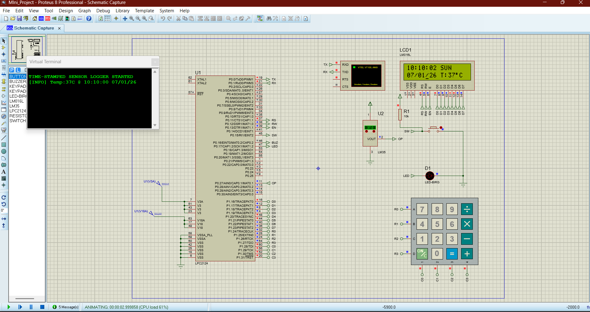

# ⏱ TIME-STAMPED SENSOR DATA LOGGER  

**LPC2124 / LPC21xx (ARM7TDMI-S) | Embedded C | Keil µVision | Proteus**

---

## 📌 Project Description  

**TIME-STAMPED SENSOR DATA LOGGER** is a real-time embedded system developed using the **LPC2124 (ARM7TDMI-S)** microcontroller.  
The system continuously acquires **analog temperature data (LM35)** using the ADC, synchronizes each reading with the **RTC**, and logs the data with **accurate time & date stamps**.

The data is:  
✔ Displayed on a **16×2 LCD**  
✔ Logged to a **PC terminal via UART**  
✔ Controlled using a **Keypad-based menu system**

This project demonstrates **real-time data acquisition, time synchronization, peripheral interfacing, and modular embedded firmware design** using ARM7.

---

## 🎯 Objectives  

- Acquire real-time sensor data using ADC  
- Attach accurate timestamps using RTC  
- Display readings on LCD  
- Log data via UART to PC  
- Provide user interaction through a keypad  

---

## ✨ Key Features  

- ⏰ RTC-based Time & Date Stamping  
- 📊 Real-Time Sensor Data Logging  
- 📟 LCD Menu Interface  
- ⌨ Keypad Navigation  
- 📡 UART Serial Monitoring  
- 🚨 Over-Temperature Alert System  
- 🧩 Modular Embedded C Architecture  

---

## 🧰 Hardware Requirements  

| Component      | Description               |
|----------------|---------------------------|
| MCU            | LPC2124 / LPC21xx (ARM7)  |
| Sensor         | LM35 Temperature Sensor  |
| Display        | 16×2 LCD (HD44780)        |
| Input          | 4×4 Matrix Keypad        |
| Communication  | UART (Virtual Terminal)  |
| Indicator      | LED + Buzzer             |
| Simulation     | Proteus 8 Professional   |

---

## 💻 Software Tools  

- Keil µVision  
- Embedded C  
- Proteus 8 Professional  
- Serial Terminal  

---

## 🔌 Correct Pin Configuration (LPC2124)  

### 📟 LCD (8-bit Mode)

| LCD Pin | MCU Pin     |
|---------|-------------|
| RS      | P0.10       |
| RW      | P0.11       |
| EN      | P0.12       |
| D0–D7   | P1.16–P1.23 |

---

### ⌨ Keypad  

| Signal | MCU Pin     |
|--------|-------------|
| R0–R3  | P1.24–P1.27 |
| C0–C3  | P1.28–P1.31 |

---

### 📡 UART  

| Signal | MCU Pin |
|--------|---------|
| TXD    | P0.0    |
| RXD    | P0.1    |

---

### 📊 ADC  

| Channel | MCU Pin |
|---------|---------|
| AD0.1   | P0.28   |

---

### 🚨 LED / Buzzer  

| Device | MCU Pin |
|--------|---------|
| LED    | P0.17   |
| BUZZER | P0.16   |

---


## ⚙️ System Workflow

1. MCU Initialization  
2. LCD + UART Startup  
3. RTC Setup  
4. ADC Sensor Sampling (LM35)  
5. Timestamp Attachment  
6. LCD Display  
7. UART Logging  
8. Keypad Menu Control  
9. Over-Temperature Alert (LED + Buzzer)  

---

## 🚀 Future Enhancements  

- SD Card / EEPROM Storage  
- IoT Cloud Integration  
- GSM Alerts  
- Multiple Sensor Inputs  
- Low-Power Mode  

---

## 🎓 Academic Relevance  

This project demonstrates:

- ARM7 Embedded Programming  
- RTC, ADC, UART, LCD & Keypad Interfacing  
- Real-Time Data Logging  
- Firmware Modularity  

---

## 👩‍💻 Developed By  

**Shivanjali Dhumal**  
Embedded Systems | IoT | ARM Microcontrollers

## 📸 Hardware & Simulation Outputs  

The following results were captured during testing:

### 🔹 LCD Startup & Initial Logging  


---

### 🔹 Menu Interface Screen  


---

### 🔹 RTC Update Screen  


### 🔹 Real-Time Temperature Logging Screen  


---


### 📁 Project Structure  

```bash
Mini_Project/
│
├── mini_proj/
│   └── MIni_Proj_main.c
│
├── adc/
│   ├── adc.c
│   └── adc_defines.h
│
├── lm35/
│   ├── lm35.c
│   └── lm35.h
│
├── rtc/
│   ├── rtc.c
│   ├── rtc.h
│   └── rtc_defines.h
│
├── uart/
│   ├── uart.c
│   └── uart.h
│
├── lcd/
│   ├── lcd.c
│   └── lcd.h
│
├── keypad/
│   ├── keypad.c
│   └── keypad.h
│
├── display/
│   ├── display.c
│   └── display.h
│
├── edit/
│   ├── Edit_mode.c
│   └── edit_mode.h
│
├── alert_sys/
│   ├── alert_sys.c
│   └── alert_sys.h
│
├── defines/
│   └── defines.h
│
├── types/
│   └── types.h
│
└── README.md


